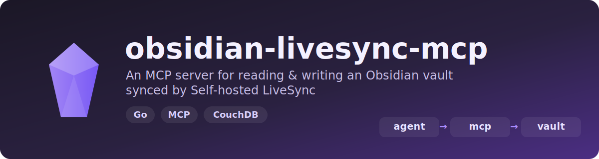

<p align="center">
  
</p>

A standalone **MCP HTTP server** (Go) that lets AI agents read and write an
Obsidian vault synced by [Self-hosted LiveSync](https://github.com/vrtmrz/obsidian-livesync).
It exposes the note CRUD surface (list, read, write, append, delete, move,
search, metadata) over MCP Streamable HTTP.

<p align="left">
  <a href="https://github.com/adambenhassen/obsidian-livesync-mcp/actions/workflows/ci.yml"></a>
</p>

> **Installing with an AI agent?** Point it at [`llms.txt`](llms.txt) — a concise,
> agent-oriented setup guide (requirements, Docker/local install, env vars, tools,
> and data-safety notes).

## Architecture

```
AI agent ──HTTP (MCP Streamable)──▶ livesync-mcp (Go) ──fs──▶ ./vault/*.md
                                                                   ▲
                                                                   │ chokidar watch +
                                                                   │ bidirectional sync
                                  livesync-cli daemon (Node) ──────┴──▶ remote CouchDB
```

The Go process supervises a `livesync-cli <db> daemon --vault <vault>`
subprocess (Node), which owns all chunking, end-to-end encryption, and conflict
handling. The Go MCP server only ever touches plain `.md` files under the vault;
writes propagate to CouchDB via the daemon's filesystem watcher — exactly as if
a human edited the note in Obsidian.

The data boundary is the **filesystem**, which is why the MCP server can be Go:
it never touches LiveSync's TypeScript. Trade-off: notes are eventually
consistent (~1s sync latency), not read straight from the live DB.

## Prerequisites

- A built `livesync-cli` (Node) — not published to npm; build it from the
  upstream repo or use the bundled Docker image (see below).
- A reachable CouchDB configured as a LiveSync remote.
- A database directory whose `.livesync/settings.json` holds the CouchDB
  connection (the Docker entrypoint seeds this for you).

## Configuration

All configuration is via environment variables:

| Variable         | Required | Default            | Purpose |
|------------------|----------|--------------------|---------|
| `LIVESYNC_VAULT` | yes      | —                  | Vault directory of `.md` files |
| `LIVESYNC_DB`    | yes      | —                  | livesync-cli database directory |
| `LIVESYNC_CLI`   | no       | `livesync-cli`     | Path to the CLI launcher |
| `MCP_ADDR`       | no       | `127.0.0.1:8765`   | HTTP listen address |
| `MCP_API_KEY`    | no       | _(empty)_          | Bearer token; empty disables auth |
| `READ_ONLY`      | no       | `false`            | When `true`, only the read tools are exposed |
| `COUCHDB_URI`    | no       | —                  | CouchDB URL — enables conflict detection (see below) |
| `COUCHDB_USER`   | no       | —                  | CouchDB user for conflict queries |
| `COUCHDB_PASSWORD`| no      | —                  | CouchDB password for conflict queries |
| `COUCHDB_DBNAME` | no       | —                  | CouchDB database name |
| `COUCHDB_PASSPHRASE` | no   | _(empty)_          | E2EE passphrase; empty disables encryption. Must match the vault |
| `COUCHDB_PASSPHRASE_B64` | no | _(empty)_        | Same as `COUCHDB_PASSPHRASE` but standard padded base64; when set it is decoded and **overrides** `COUCHDB_PASSPHRASE`. Honored by both the daemon seed and the Go server. Invalid base64 is fatal |
| `USE_PATH_OBFUSCATION` | no | `false`            | Must match the vault's "Use path obfuscation" setting (see below). Requires `COUCHDB_PASSPHRASE` |

(The Docker image already passes the `COUCHDB_*` values, so conflict detection
works out of the box there.)

### Path obfuscation

If the vault was created in Obsidian with **Settings → "Use path obfuscation"**
enabled, set `USE_PATH_OBFUSCATION=true`. The value must match what the vault was
created with. If it doesn't, the daemon still reports a successful sync but writes
every note as a **0-byte file** (it can list paths but cannot resolve the content
chunks), and `read_note` returns empty strings. Likewise, an E2EE vault needs
`COUCHDB_PASSPHRASE` set to the same passphrase used to create it.

### Read-only mode

Set `READ_ONLY=true` to expose only `list_notes`, `read_note`, `search_notes`,
and `get_note_metadata`. The mutating tools (`write_note`, `append_to_note`,
`delete_note`, `move_note`) are **not registered at all**, so an agent cannot
see or call them — a hard guarantee that the vault won't be modified.

## Running

### Docker Compose (CouchDB + CLI + MCP, all-in-one)

```bash
docker compose up --build
curl -s -H "Authorization: Bearer changeme" http://localhost:8765/healthz
```

This builds `livesync-cli` from source inside the image, stands up CouchDB,
seeds the sync database, and starts the MCP server on `:8765`.

The image caps the sync daemon's Node heap (`NODE_OPTIONS=--max-old-space-size=256`)
so the long-running daemon doesn't grow unbounded over time — override with
`-e NODE_OPTIONS=...` for very large vaults. Compose additionally sets
`mem_limit: 1g` on the service as a hard backstop; combined with
`restart: unless-stopped`, a runaway container is OOM-killed and restarted with
sync resuming.

### Prebuilt image (GHCR)

Each version tag publishes a server image to the GitHub Container Registry:

```bash
docker pull ghcr.io/adambenhassen/obsidian-livesync-mcp:latest
```

Bring your own CouchDB and a seeded db dir, then pass the env vars (see
Configuration). To make `docker-compose.yml` use the published image instead of
building from source, add `image: ghcr.io/adambenhassen/obsidian-livesync-mcp:latest`
to the `livesync-mcp` service.

### Locally (you supply the CLI + a configured db dir)

```bash
LIVESYNC_VAULT=/path/to/vault \
LIVESYNC_DB=/path/to/db \
LIVESYNC_CLI=/path/to/livesync-cli \
MCP_API_KEY=changeme \
  go run ./cmd/livesync-mcp
```

## Endpoints

- `POST /mcp` — MCP Streamable HTTP. Requires `Authorization: Bearer <MCP_API_KEY>`
  when a key is set.
- `GET /healthz` — `200` when the sync daemon is running, `503` when it is down.

## MCP tools

| Tool | Behaviour |
|------|-----------|
| `list_notes(folder?, recursive?)` | List notes (+ size/mtime) under a folder |
| `read_note(path)` | Return note content |
| `write_note(path, content, overwrite?)` | Create or update a note |
| `append_to_note(path, content)` | Append to a note |
| `delete_note(path)` | Delete a note (propagates to CouchDB) |
| `move_note(from, to)` | Rename / move a note |
| `search_notes(query, mode)` | Search by `filename` or `content` |
| `get_note_metadata(path)` | Size, modification time |

All note paths are **vault-relative and forward-slashed** (e.g.
`Daily/2026-06-15.md`); absolute paths, `..` traversal, and symlinks escaping
the vault are rejected.

### Deletion semantics

`delete_note` removes the file from the vault, and the daemon propagates the
deletion to CouchDB. Verified end-to-end: LiveSync **soft-deletes** — the
CouchDB document is not removed via CouchDB's native `_deleted`; instead its body
gains `"deleted": true` (with a bumped `_rev`), which is the tombstone other
LiveSync clients use to remove the note locally. So a deleted note still appears
in `_all_docs`, but its body carries the deletion marker.

### Sync conflicts

When the `COUCHDB_*` vars are set, the server detects unresolved sync conflicts
(another LiveSync client edited the same note concurrently) by querying CouchDB
over HTTP — no daemon pause needed. It's scoped to the note being touched:

- **`get_note_metadata`** returns a `conflicts` array (the conflicting revision
  ids; empty when there are none) plus a `conflictCheck` field: `"ok"` (checked),
  `"unavailable"` (the check errored — `conflicts` is **not** authoritative), or
  `"disabled"` (no CouchDB configured). Check it before editing a note you didn't
  just create; treat `conflicts: []` as safe only when `conflictCheck` is `"ok"`.
- **`write_note` / `append_to_note`** refuse to edit a note that has an
  unresolved conflict (so an agent surfaces it instead of piling on). The check
  fails open — a transient CouchDB error lets the write through; the conflict is
  still caught on the next metadata read (which reports `conflictCheck:
  "unavailable"`).

Note: a conflict caused by your own write isn't visible immediately (it
materialises after the daemon pushes), so it surfaces on the *next* read.
Detection maps the note path to its CouchDB doc id. On a **path-obfuscated**
vault that id is a hash, so set `USE_PATH_OBFUSCATION=true` and `COUCHDB_PASSPHRASE`
to the vault's passphrase — the server then derives the obfuscated id and conflict
detection works as normal. (Plain E2EE encryption without path obfuscation leaves
the id as the plaintext path, so it needs no extra configuration.)

> **Caveat:** on an obfuscated vault, a *wrong* `COUCHDB_PASSPHRASE` derives a
> doc id that exists nowhere, which looks identical to "no conflict" — every note
> then reports a false `conflictCheck: "ok"`. Make sure it matches the vault. An
> empty passphrase with obfuscation on is rejected at startup.
>
> **Case-sensitive vaults are unsupported:** the bundled `livesync-cli` cannot
> sync a vault with `handleFilenameCaseSensitive` enabled (its mirror scan throws
> `Handler isStorageInsensitive is not assigned` and syncs nothing), so document
> ids are always lowercased here.

The server currently only *detects* conflicts; it can't resolve them. Resolution
still has to happen in Obsidian (or another LiveSync client).

## Roadmap

- [ ] **`resolve_conflict` tool** — let an agent resolve a detected conflict
  (pick a revision or merge) without leaving the MCP server.

## Example MCP client config

```json
{
  "mcpServers": {
    "livesync": {
      "type": "http",
      "url": "http://localhost:8765/mcp",
      "headers": { "Authorization": "Bearer changeme" }
    }
  }
}
```

## Testing

```bash
go test ./...        # unit tests (no external deps)
go vet ./...
```

End-to-end tests against a real CouchDB are gated behind a build tag — see
[`test/README.md`](test/README.md).
